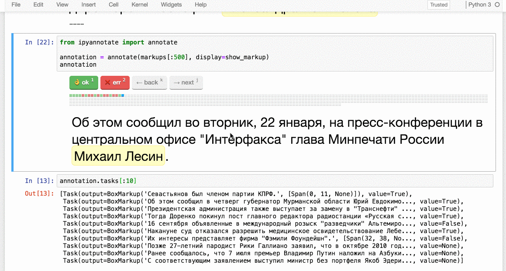

# ipyannotate  

Jupyter Widget for data annotation

## Installation

To install use pip:

    $ pip install ipyannotate
    $ jupyter nbextension enable --py --sys-prefix ipyannotate

For a development installation (requires npm),

    $ git clone https://github.com/alexanderkuk/ipyannotate.git
    $ cd ipyannotate
    $ pip install -e .
    $ jupyter nbextension install --py --symlink --sys-prefix ipyannotate
    $ jupyter nbextension enable --py --sys-prefix ipyannotate

For examples see [ipyannotate-examples](http://nbviewer.jupyter.org/github/natasha/ipyannotate-examples/tree/master/), for documentation and more explanation see [ipyannotate documentation](http://nbviewer.jupyter.org/github/natasha/ipyannotate/blob/master/docs/index.ipynb).

## License

Source code of `ipyannotate` is distributed under MIT license (allows modification and commercial usage)

## Support

- Chat — https://telegram.me/natural_language_processing
- Issues — https://github.com/natasha/ipyannotate/issues
